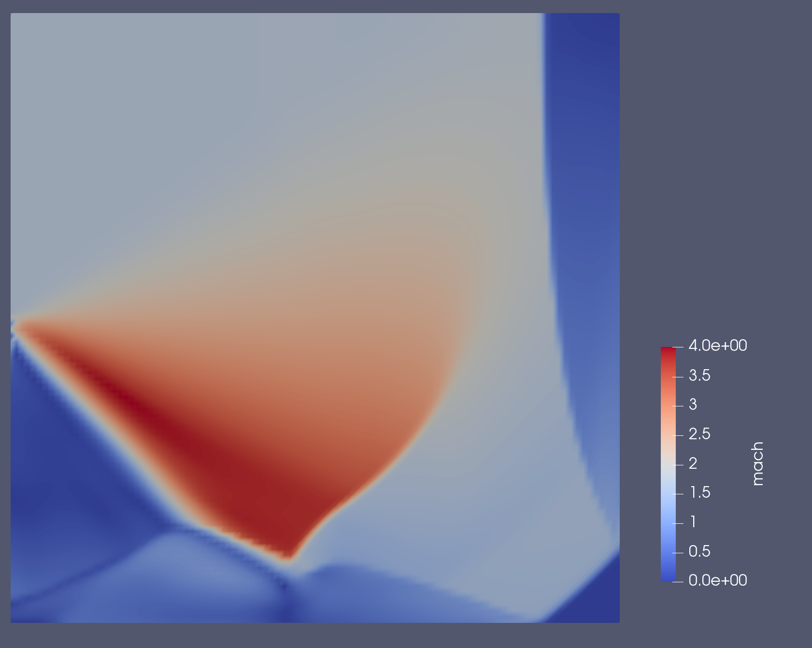
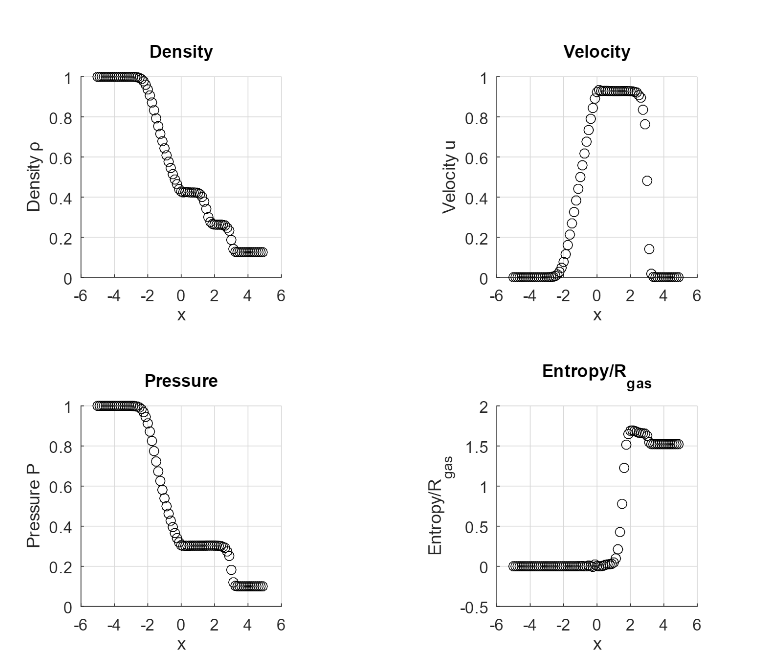

# cfd_solvers_cpp
C++ CFD. the initial interest is in hyperbolic conservation laws in 1D, 2D, and 3D, simple structured meshes to begin.

I rolled my own arrays for this.  Probably want to update with Eigen, but allow for hybridized approaches as we will go to the GPU.

# 2-D unstructured mesh

Here is the supersonic flow entering a box and reflecting off the sides:

# 1-D 

Here is the Shock Tube solution computed with the 1D partition of this code:

